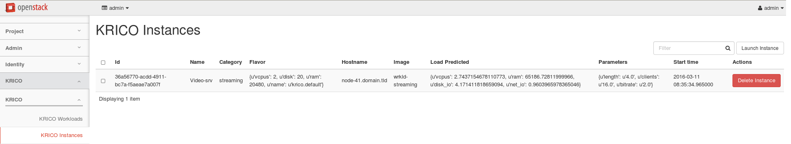
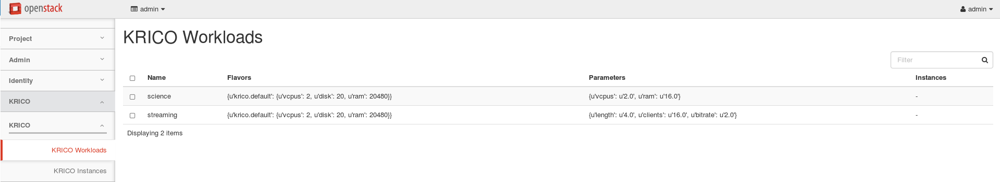

**KRICO with Horizon integration**

KRICO dashboard architecture

KRICO Dashboard
<ul>
	<li>KRICO Group</li>
	<li>Instances Panel
		<ul>
			<li>Launcher functionality</li>
			<li>Instances listing</li>
			<li>Classifier</li>
		</ul>
	</li>
	<li>Workloads Panel
		<ul>
			<li>Workload listing (with flavors)</li>
			<li>Creating flavor</li>
		</ul>
	</li>
</ul>	

Current status of work:

*Launching and listing VMs basic functionality*

*Listing workloads*

KRICO API extensions were done parallel with implementing dashboard with panels. There are still some missing functionalities in KRICO to complete currently implemented panels.

In next step we want to enable deleting instances through the dashboard (instead of using original horizon dashboard)

Both panels are not completed yet, but they enables to launch new instances.

Next steps are extend API with another functionalities like: 
<ul>
	<li>deleting VMs, </li>
	<li>creating flavors using prediction call, </li>
	<li>classification of instances not running with KRICO</li>
</ul>
